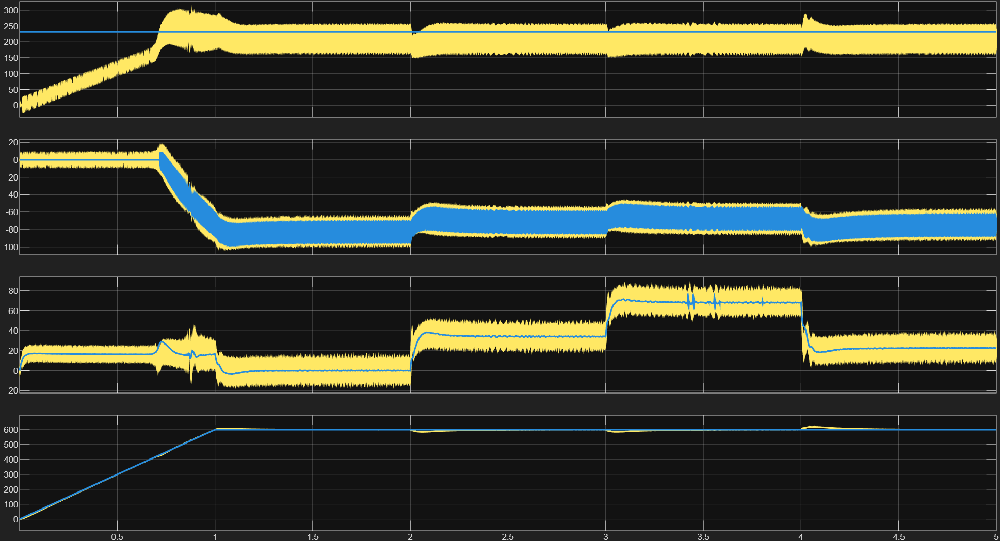
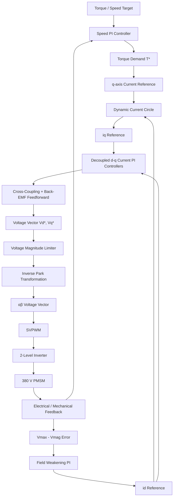

# High-Voltage PMSM Field-Oriented Control (FOC) Drive

**Model-Based Design (MBD) and simulation of a closed-loop traction drive for an 86 kW Permanent Magnet Synchronous Motor (PMSM), developed for high-performance electric motorsport and high-voltage hybrid powertrain applications.**

<p align="center">
  
</p>

<p align="center">
  <strong>380 V DC-Link · 86 kW PMSM · 10 kHz FOC · SVPWM · Field Weakening · MATLAB/Simulink</strong>
</p>

---

## Overview

This project implements a **closed-loop Field-Oriented Control (FOC)** architecture for a high-performance Permanent Magnet Synchronous Motor (PMSM).

The model is designed around a **380 V DC-link**, an **86 kW peak power target**, and a **10 kHz discrete-time control loop**, with emphasis on the control challenges encountered in high-performance electric traction systems.

The main objective is to demonstrate a complete traction-control architecture capable of operating from the constant-torque region through **active flux weakening**, while maintaining current, voltage, and inverter constraints.

### Key objectives

* Closed-loop PMSM torque and speed control
* Decoupled d-q current regulation
* Automatic field-weakening operation
* Dynamic current-circle limitation
* Space Vector PWM (SVPWM)
* Cross-coupling feedforward compensation
* Back-EMF compensation
* Anti-windup current controllers
* Voltage-vector saturation
* High-speed operation up to **600 rad/s (~5,730 RPM)**
* Model-based validation in MATLAB/Simulink

---

# Technical Highlights

## High-Voltage Architecture

The drive is designed around a:

* **380 V DC-link**
* Two-level three-phase inverter
* PMSM traction motor
* 10 kHz switching frequency
* Closed-loop speed and current control

The architecture is representative of the control layer required for high-performance electric propulsion systems.

---

## Full-Speed Envelope Operation

The controller operates across two primary regions.

### Constant-Torque Region

At low and medium speeds:

$$
i_d^* = 0
$$

The controller operates near maximum torque-per-ampere conditions while maintaining the required torque-producing current:

$$
i_q^* \rightarrow T^*
$$

---

### Flux-Weakening Region

As motor speed increases, the required stator voltage approaches the available inverter voltage.

The controller automatically introduces negative d-axis current:

$$
i_d^* < 0
$$

to reduce the effective air-gap flux and maintain operation beyond base speed.

The simulated operating envelope reaches:

$$
\omega = 600\ \text{rad/s}
$$

which corresponds to approximately:

$$
N \approx 5729.6\ \text{RPM}
$$

---

# Control Architecture

The complete control architecture follows the structure below:



---

# Decoupled Current Regulation

The inner current-control loop operates in the rotating **d-q reference frame**.

The controller includes feedforward compensation for the main cross-coupling and back-EMF terms.

## d-axis

The d-axis voltage command includes the q-axis cross-coupling term:

$$
v_d^*
=
v_{d,PI}
-
p\omega_e L_q i_q
$$

## q-axis

The q-axis voltage command includes both cross-coupling and permanent-magnet back-EMF compensation:

$$
v_q^*
=
v_{q,PI}
+
p\omega_e
\left(
L_d i_d + \psi_m
\right)
$$

where:

- $p$ = number of pole pairs
- $\omega_e$ = electrical angular velocity
- $L_d$ = d-axis inductance
- $L_q$ = q-axis inductance
- $\psi_m$ = permanent-magnet flux linkage

This decoupling improves dynamic current tracking, particularly during high-speed operation and aggressive torque transients.

---

# Space Vector PWM

The inverter is controlled using **Space Vector Pulse Width Modulation (SVPWM)**.

SVPWM provides better utilization of the available DC-link voltage compared with conventional sinusoidal PWM.

For a 380 V DC-link:

$$
V_{max}
=
\frac{V_{dc}}{\sqrt{3}}
$$

Therefore:

$$
V_{max}
=
\frac{380}{\sqrt{3}}
\approx
219.39\ V
$$

The controller uses the linear modulation boundary to prevent overmodulation.

> **Note:** The exact voltage magnitude shown in the validation plots must be consistent with the modulation convention implemented in the Simulink model.

---

# Dynamic Current Circle Constraint

The controller enforces a dynamic current constraint:

$$
i_d^2+i_q^2\leq I_{max}^2
$$

For:

$$
I_{max}=100\ A
$$

the available q-axis current is dynamically limited according to:

$$
i_{q,max}
=
\sqrt{
I_{max}^2-i_d^2
}
$$

This becomes particularly important during field weakening because increasingly negative $i_d$ reduces the current available for torque production.

The controller therefore dynamically coordinates:

* Field-weakening current
* Torque-producing current
* Inverter current capability

---

# Anti-Windup and Voltage Saturation

The current regulators operate at a discrete switching frequency of:

$$
f_{sw}=10\text{ kHz}
$$

with a sampling period of:

$$
T_s=\frac{1}{f_{sw}}=100\ \mu s
$$

The PI controllers incorporate anti-windup behavior to prevent integrator accumulation when the commanded voltage vector reaches the inverter voltage limit.

The voltage reference is constrained according to:

$$
\sqrt{v_d^{*2}+v_q^{*2}}
\leq
V_{max}
$$

This prevents the controller from continuously requesting voltage vectors that cannot be physically synthesized by the inverter.

---

# Field-Weakening Validation

The validation case evaluates the closed-loop drive across the full operating envelope.

The simulation includes:

* Speed ramp to 600 rad/s
* Automatic field-weakening activation
* Negative d-axis current injection
* q-axis torque-current regulation
* Dynamic current-circle limitation
* Voltage-vector saturation
* Load-torque disturbances
* Speed recovery

### Validation sequence

| Event           |              Time | Description                            |
| --------------- | ----------------: | -------------------------------------- |
| Speed ramp      |             0–5 s | Motor accelerates toward 600 rad/s     |
| Load step       |             2.0 s | External torque disturbance            |
| Load step       |             3.0 s | External torque disturbance            |
| Load step       |             4.0 s | External torque disturbance            |
| Field weakening | High-speed region | Negative $i_d$ activated automatically |

---

## Validation Results

### 1. Voltage Magnitude

The voltage magnitude is monitored against the available inverter voltage limit.

The controller prevents the voltage reference from exceeding the linear modulation boundary, avoiding uncontrolled overmodulation.

---

### 2. d-axis Current

At lower speeds:

$$
i_d \approx 0\ A
$$

Once the motor approaches its voltage limit, field weakening becomes active:

$$
i_d < 0
$$

The simulated trajectory reaches approximately:

$$
i_d \approx -90\ A
$$

during the high-speed operating region.

---

### 3. q-axis Current

The q-axis current provides the primary torque-producing component.

Its maximum value is dynamically constrained by the current circle:

$$
|i_q|
\leq
\sqrt{
I_{max}^2-i_d^2
}
$$

Consequently, increasing the magnitude of negative $i_d$ reduces the maximum available torque-producing current.

---

### 4. Mechanical Speed

The speed controller tracks the commanded trajectory up to:

$$
\omega_m=600\ \text{rad/s}
$$

The response is also evaluated under external load-torque disturbances to verify closed-loop speed recovery.

---

# Machine Specifications

| Parameter                     |     Symbol | Value | Unit  |
| ----------------------------- | ---------: | ----: | ----- |
| DC-Link Voltage               |   $V_{dc}$ |   380 | V     |
| Peak Output Power             | $P_{peak}$ |    86 | kW    |
| Stator Phase Resistance       |      $R_s$ | 0.015 | Ω     |
| d-Axis Inductance             |      $L_d$ |  0.12 | mH    |
| q-Axis Inductance             |      $L_q$ |  0.15 | mH    |
| Permanent Magnet Flux Linkage |   $\psi_m$ | 0.055 | Wb    |
| Pole Pairs                    |        $p$ |     4 | —     |
| Switching Frequency           |   $f_{sw}$ |    10 | kHz   |
| Maximum Current               |  $I_{max}$ |   100 | A     |
| Maximum Mechanical Speed      | $\omega_m$ |   600 | rad/s |
| Maximum Mechanical Speed      |      $N_m$ | ~5730 | RPM   |

---

# Project Structure

```text
fsae-pmsm-foc-drive/
│
├── docs/
│   └── field_weakening_validation_600rad.png
│
├── models/
│   └── pmsm_foc_drive.slx
│
├── scripts/
│   └── init_params.m
│
├── README.md
│
└── LICENSE
```

---

# Model-Based Design Workflow

The project follows a Model-Based Design workflow:

```text
System Requirements
       │
       ▼
Machine Parameterization
       │
       ▼
PMSM Mathematical Model
       │
       ▼
FOC Controller Design
       │
       ├── Speed PI
       ├── Current PI
       ├── Field Weakening
       ├── Current Circle
       └── Anti-Windup
       │
       ▼
SVPWM
       │
       ▼
2-Level Inverter
       │
       ▼
PMSM
       │
       ▼
Closed-Loop Validation
```

---

# MATLAB / Simulink

The project is intended for **MATLAB/Simulink-based Model-Based Design**.

## Requirements

Recommended environment:

* MATLAB
* Simulink
* Simscape Electrical
* Control System Toolbox

---

# Quick Start

## 1. Clone the repository

```bash
git clone https://github.com/pradojrr/fsae-pmsm-foc-drive.git
cd fsae-pmsm-foc-drive
```

## 2. Initialize parameters

Open MATLAB and execute:

```matlab
run('scripts/init_params.m')
```

This initializes the machine, inverter, controller, and simulation parameters.

## 3. Open the Simulink model

Open:

```text
models/pmsm_foc_drive.slx
```

Then run the simulation.

---

# Expected Simulation Outputs

The model is intended to provide the following primary signals:

```text
Mechanical Speed
       │
       ├── ωm
       │
       ▼
Current Controller
       │
       ├── id
       ├── iq
       │
       ▼
Voltage Controller
       │
       ├── vd
       ├── vq
       │
       ▼
SVPWM
       │
       ├── Duty A
       ├── Duty B
       └── Duty C
```

The validation results should demonstrate:

* Stable current regulation
* Speed-reference tracking
* Automatic transition into field weakening
* Voltage limitation
* Current-circle enforcement
* Load disturbance rejection
* High-speed operation

---

# Engineering Notes

This project is primarily a **control-system and simulation study**.

The numerical machine parameters represent the current simulation configuration and should not automatically be interpreted as measured characteristics of a production traction motor.

For hardware implementation, the following elements require independent validation:

* Motor parameter identification
* Thermal limits
* Magnet demagnetization limits
* DC-link capacitor sizing
* Semiconductor SOA
* Gate-driver behavior
* Dead-time compensation
* Current-sensor bandwidth
* Rotor-position sensing
* DC-link protection
* Overcurrent protection
* Insulation coordination
* HV interlock architecture
* Functional safety

---

# Applications

The control architecture is relevant to:

* Formula SAE Electric
* Electric motorsport
* High-performance EV traction
* Hybrid powertrains
* PMSM traction drives
* High-speed electric machines
* Power-electronics research
* Model-Based Design
* Advanced motor-control research

---

# Author

**Ronaldo de Oliveira Prado Junior**

Founder & Powertrain Director | **F.R.O.G. Racing — Formula SAE Electric**

Electrical Engineering Student | **Universidade Federal de Mato Grosso do Sul (UFMS)**

* LinkedIn: [linkedin.com/in/engrpjunior](https://linkedin.com/in/engrpjunior)
* GitHub: [github.com/pradojrr](https://github.com/pradojrr)

---

# License

This project is intended for educational, research, and engineering-development purposes.

See `LICENSE` for details.

---

<p align="center">
  <strong>High Voltage · High Speed · Model-Based Control</strong>
</p>
